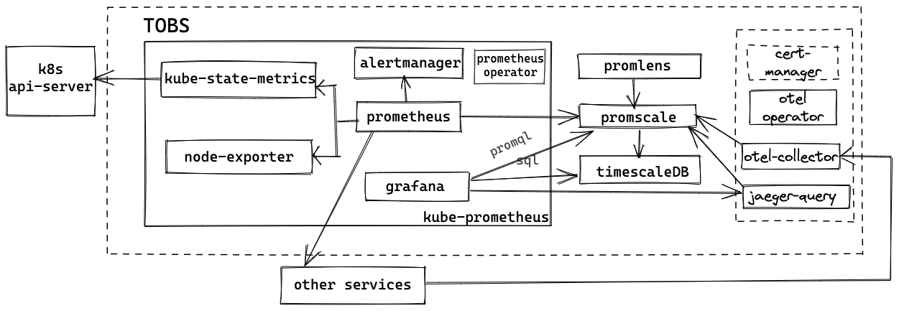

# tobs - The Observability Stack for Kubernetes

[](https://goreportcard.com/report/github.com/timescale/tobs)
[](https://pkg.go.dev/github.com/timescale/tobs/cli)

Tobs is a tool that aims to make it as easy as possible to install a full observability
stack into a Kubernetes cluster. Currently this stack includes:



* [Kube-Prometheus](https://github.com/prometheus-operator/kube-prometheus#kube-prometheus) the Kubernetes monitoring stack
  * [Prometheus](https://github.com/prometheus/prometheus) to collect metrics
  * [AlertManager](https://github.com/prometheus/alertmanager#alertmanager-) to fire the alerts
  * [Grafana](https://github.com/grafana/grafana) to visualize what's going on
  * [Node-Exporter](https://github.com/prometheus/node_exporter) to export metrics from the nodes
  * [Kube-State-Metrics](https://github.com/kubernetes/kube-state-metrics) to get metrics from kubernetes api-server
  * [Prometheus-Operator](https://github.com/prometheus-operator/prometheus-operator#prometheus-operator) to manage the life-cycle of Prometheus and AlertManager custom resource definitions (CRDs)
* [Promscale](https://github.com/timescale/promscale) ([design doc](https://tsdb.co/prom-design-doc)) to store metrics for the long-term and allow analysis with both PromQL and SQL.
* [TimescaleDB](https://github.com/timescale/timescaledb) for long term storage of metrics and provides ability to query metrics data using SQL.
* [Promlens](https://promlens.com/) tool to build and analyse promql queries with ease.
* [Opentelemetry-Operator](https://github.com/open-telemetry/opentelemetry-operator#opentelemetry-operator-for-kubernetes) to manage the lifecycle of OpenTelemetryCollector Custom Resource Definition (CRDs)

We plan to expand this stack over time and welcome contributions.

Tobs provides a CLI tool to make deployment and operations easier. We also provide
Helm charts that can be used directly or as sub-charts for other projects.

See a demo of tobs in action by clicking the video below:

<p align="center">
<a href="https://www.youtube.com/watch?v=MSvBsXOI1ks">  </a>
</p>

# 🔥 Quick start

## Installing the CLI tool

To download and install tobs, run the following in your terminal, then follow the on-screen instructions.

```bash
curl --proto '=https' -A 'tobs' --tlsv1.2 -sSLf  https://tsdb.co/install-tobs-sh |sh
```

Alternatively, you can download the CLI directly via [our releases page](https://github.com/timescale/tobs/releases/latest)

Getting started with the CLI tool is a two-step process: First you install the CLI tool locally, then you use the CLI tool to install the tobs stack into your Kubernetes cluster.

## Using the tobs CLI tool to deploy the stack into your Kubernetes cluster

After setting up tobs run the following to install the tobs helm charts into your Kubernetes cluster

```bash
tobs install
```

This will deploy all of the tobs components into your cluster and provide instructions as to next steps.

### Tracing support

From `0.7.0` release tobs supports installation of tracing components. To install tracing components use

```
tobs install --tracing
```

For more details on tracing support visit [Promscale tracing docs](https://github.com/timescale/promscale/blob/master/docs/tracing.md).

## Using the tobs CLI tool

The CLI tool ([usage guide](https://github.com/timescale/tobs/tree/master/cli#usage-guide)) provides the most seamless experience for interacting with tobs.

# Configuring the stack

All configuration for all components happens through the helm values.yaml file.
You can view the self-documenting [default values.yaml](chart/values.yaml) in the repo.
We also have additional documentation about individual configuration settings in our
[Helm chart docs](chart/README.md#configuring-helm-chart).

To modify the settings, first create a values.yaml file:

```bash
tobs helm show-values > values.yaml
```

Then modify the values.yaml file using your favorite editor.
Finally, deploy with the new settings using:

```bash
tobs install -f values.yaml
```

# 🛠Alternative deployment methods

## Using the Helm charts without the CLI tool

Users sometimes want to use our Helm charts as sub-charts for other project or integrate them into their infrastructure without using our CLI tool. This is a supported use-case and instructions on using the Helm charts can be found [here](/chart/README.md).

# Compatibility matrix

## Tobs vs. Kubernetes

| Tobs  | Kubernetes     |
|-------|----------------|
| 0.8.x | v1.21 to v1.23 |
| 0.7.x | v1.19 to v1.21 |

# ✏️ Contributing

We welcome contributions to tobs, which is
licensed and released under the open-source Apache License, Version 2.  The
same [Contributor's
Agreement](https://github.com/timescale/timescaledb/blob/master/CONTRIBUTING.md)
applies as in TimescaleDB; please sign the [Contributor License
Agreement](https://cla-assistant.io/timescale/tobs) (CLA) if
you're a new contributor.
