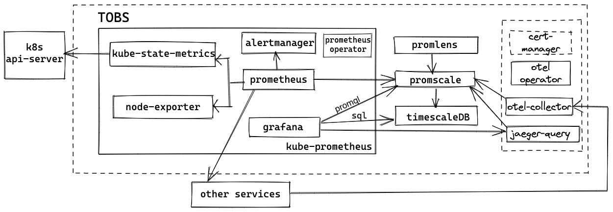

# tobs - The Observability Stack for Kubernetes

[](https://goreportcard.com/report/github.com/timescale/tobs)
[](https://pkg.go.dev/github.com/timescale/tobs/cli)

Tobs is a tool that aims to make it as easy as possible to install a full observability
stack into a Kubernetes cluster. Currently this stack includes:



* [Kube-Prometheus](https://github.com/prometheus-operator/kube-prometheus#kube-prometheus) the Kubernetes monitoring stack
  * [Prometheus](https://github.com/prometheus/prometheus) to collect metrics
  * [AlertManager](https://github.com/prometheus/alertmanager#alertmanager-) to fire the alerts
  * [Grafana](https://github.com/grafana/grafana) to visualize what's going on
  * [Node-Exporter](https://github.com/prometheus/node_exporter) to export metrics from the nodes
  * [Kube-State-Metrics](https://github.com/kubernetes/kube-state-metrics) to get metrics from kubernetes api-server
  * [Prometheus-Operator](https://github.com/prometheus-operator/prometheus-operator#prometheus-operator) to manage the life-cycle of Prometheus and AlertManager custom resource definitions (CRDs)
* [Promscale](https://github.com/timescale/promscale) ([design doc](https://tsdb.co/prom-design-doc)) to store metrics for the long-term and allow analysis with both PromQL and SQL.
* [TimescaleDB](https://github.com/timescale/timescaledb) for long term storage of metrics and provides ability to query metrics data using SQL.
* [Promlens](https://promlens.com/) tool to build and analyse promql queries with ease.
* [Opentelemetry-Operator](https://github.com/open-telemetry/opentelemetry-operator#opentelemetry-operator-for-kubernetes) to manage the lifecycle of OpenTelemetryCollector Custom Resource Definition (CRDs)

We plan to expand this stack over time and welcome contributions.

Tobs provides a helm chart to make deployment and operations easier. It can be used directly or as a sub-chart for other projects.

# Quick start

## Prerequisites

Using tobs to install full observability stack with openTelemetry support currently requires installation of cert-manager.
To do install it please follow [cert-manager documentation](https://cert-manager.io/docs/installation/).

*Note*: cert-manager is not required when using tobs with opentelemetry support disabled.

## Installing the helm chart

The following command will install Kube-Prometheus, OpenTelemetry Operator, TimescaleDB, and Promscale
into your Kubernetes cluster:

```
helm repo add timescale https://charts.timescale.com/
helm repo update
helm install --wait <release_name> timescale/tobs
```

*Note*: `--wait` flag is necessary for successfull installation as tobs helm chart can create opentelemetry Custom Resources only after opentelemetry-operator is up and running. This flag can be omitted when using tobs without opentelemetry support.

For detailed configuration and usage instructions, take a look at the [helm chart's README](/chart/README.md).

# Configuring the stack

All configuration for all components happens through the helm values.yaml file.
You can view the self-documenting [default values.yaml](chart/values.yaml) in the repo.
We also have additional documentation about individual configuration settings in our
[Helm chart docs](chart/README.md#configuring-helm-chart).

# Alternative deployment methods

## Using the `tobs` CLI tool

We also provide a CLI tool to deploy tobs on a Kubernetes cluster. The CLI tool ([usage guide](https://github.com/timescale/tobs/tree/master/cli#usage-guide)) provides detailed instructions on how to use the CLI for managing tobs.

*NOTE*: At this point, the CLI tool is just a thin wrapper around the helm chart, and hence it's set to be removed in future releases.

# Compatibility matrix

## Tobs vs. Kubernetes

| Tobs   | Kubernetes     |
|--------|----------------|
| 0.11.x | v1.23 to v1.24 |
| 0.10.x | v1.21 to v1.23 |
| 0.9.x  | v1.21 to v1.23 |
| 0.8.x  | v1.21 to v1.23 |
| 0.7.x  | v1.19 to v1.21 |

# Contributing

We welcome contributions to tobs, which is
licensed and released under the open-source Apache License, Version 2.  The
same [Contributor's
Agreement](https://github.com/timescale/timescaledb/blob/master/CONTRIBUTING.md)
applies as in TimescaleDB; please sign the [Contributor License
Agreement](https://cla-assistant.io/timescale/tobs) (CLA) if
you're a new contributor.
