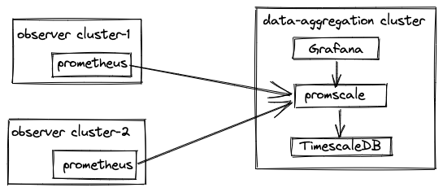

# Tobs helm values config

## Prometheus High-Availability

**Note**: This is unnecessary if using the tobs CLI, To enable Prometheus high-availability with tobs CLI use `--enable-prometheus-ha`.

The following steps will explain how to enable Prometheus high-availability with Promscale when using tobs helm chart (without tobs CLI).

Update the tobs `values.yaml` with below HA configuration.

Increase the TimescaleDB connection pool i.e.

```
timescaledb-single:
  patroni:
    bootstrap:
      dcs:
        postgresql:
          parameters:
            max_connections: 400
```

Update the Promscale configuration to enable HA mode and increase the replicas to 3:

```
promscale:
  replicaCount: 3
  args:
    - --metrics.high-availability
```

Update Prometheus configuration to send prometheus pod name with `__replica__` and prometheus cluster name as `cluster` labelSets in the form of external labels.

```
kube-prometheus-stack:
  prometheus:
    prometheusSpec:
      replicaExternalLabelName: "__replica__"
      prometheusExternalLabelName: "cluster"
```

## Multi-cluster support



In tobs you can enable multi-cluster support to install a data aggregation cluster to collect observability data coming from different observer clusters.

With tobs you can deploy both observer clusters and data aggregation cluster.

### Deploying the data aggregation cluster

The data aggregation cluster acts as central observability cluster which stores, visualizes data flowing from observer clusters.

Steps to deploy data aggregation cluster

* Enable LoadBalancer service to Promscale to remote-wrtie, remote-read data from observer clusters.

```
promscale:
  service:
    type: LoadBalancer
```

* Add external cluster label to differentiate the visualisation in Grafana dashboards per cluster level.

```
kube-prometheus-stack:
  prometheus:
    prometheusSpec:
      externalLabels:
        cluster: <clusterName>
```

* Enable multi-cluster support in Grafana dashboards

```
kube-prometheus-stack:
  grafana:
    sidecar:
      dashboards:
        multicluster:
          global:
            enabled: true
```

### Deploying the observer cluster

The observer cluster forwards the metrics to data-aggregation/centralised monitoring cluster which supports ingesting, visualising of metrics flowing from different observer clusters.

Steps to install an observer cluster

* Disable TimescaleDB

```
timescaledb-single:
  enabled: false
```

* Disable Promscale

```
promscale:
  enabled: false
```

* Disable Grafana

```
kube-prometheus-stack:
  grafana:
    enabled: false
```

* Configure Prometheus remote-write to Promscale loadbalancer service in data aggregation cluster and add the external label representing the current cluster name to differentiate the visualisation on per cluster basis in Grafana.

```
kube-prometheus-stack:
  prometheus:
    prometheusSpec:
      externalLabels:
        cluster: <clusterName>  
      remoteRead:
      - url: "<PROMSCALE_SERVICE_ENDPOINT_OF_DATA_AGGREGATION_CLUSTER>/read"
        readRecent: true
      remoteWrite:
      - url: "<PROMSCALE_ENDPOINT>/write"  
```
