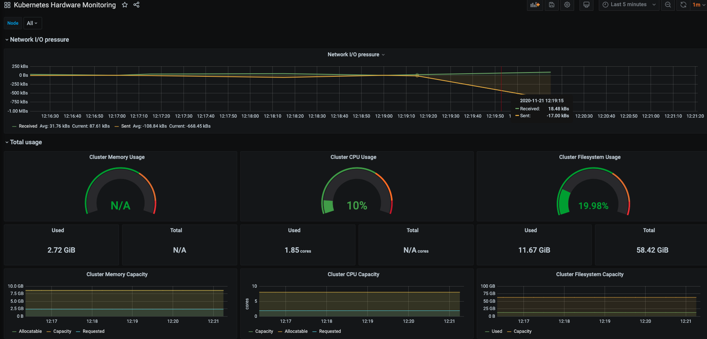

## Usage 

tobs CLI installation

`curl --proto '=https' --tlsv1.2 -sSLf  https://tsdb.co/install-tobs-sh |sh`

Available Commands:

```
$ tobs
The Observability Stack is a tool that uses TimescaleDB as a 
compressed long-term store for time series metrics from Prometheus. This
application is a CLI tool that allows users to quickly access the different
components of Observability.

Usage:
  tobs [command]

Available Commands:
  grafana      Subcommand for Grafana operations
  helm         Subcommand for Helm operations
  help         Help about any command
  install      Alias for helm install
  metrics      Subcommand for metrics operations
  port-forward Port-forwards TimescaleDB, Grafana, and Prometheus to localhost
  prometheus   Subcommand for Prometheus operations
  promlens     Subcommand for Grafana operations
  timescaledb  Subcommand for TimescaleDB operations
  uninstall    Alias for helm uninstall

Flags:
      --config string      config file (default is $HOME/.tobs.yaml)
  -h, --help               help for tobs
  -n, --name string        Helm release name (default "tobs")
      --namespace string   Kubernetes namespace (default "default")

Use "tobs [command] --help" for more information about a command.
```

### Deploying monitoring stack

`tobs install`

This will successfully deploy all the above listed components to your k8s cluster.

You can use `--name` flag to set helm release name default name is `tobs`, `--namespace` flag to deploy observability stack in namespace of your choice default is set to `default` namespace, `--chart-reference` flag to use helm chart of your choice default is set to `timescale/tobs`, `--filename` to use values.yaml file that we usually use with helm chart you can provide values.yaml of your choice by default values.yaml from the chart will be used.

### Actions for Helm:

tobs CLI internally uses helm to deploy observability stack. You can also use helm cmds such helm install, helm uninstall, show-values i.e values.yml file and delete-data to delete persistent volume claims.

#### install tobs using helm 

`tobs install` is an alias for below cmd

```
tobs helm install
```

#### uninstall tobs using helm


`tobs uninstall` is an alias for below cmd

```
tobs helm uninstall
```

#### deletes all persistent volume claims

```
tobs helm delete-data 
```

#### show values.yml file used in helm

This cmd helps us to understand values passed over to helm chart for different components.

```
tobs helm show-values
```

### Port-forward

This helps to port-forward `TimescaleDB`, `Grafana`, `Prometheus`, `Promscale` and `Promlens` to localhost i.e 

TimescaleDB to `5432`
Promlens to `8081`
Grafana to `8080`
Prometheus to `9090`
Promscale to `9201`

You can also port-forward to ports of your choice by using the flags exposed for different components. 

```
tobs port-forward
```

### Metrics

You can perform metric specifc actions such as ```chunk-interval``` & ```retantion``` 

#### chunk-interval

Shows the chunk-interval per metric i.e hybertable distribution per metric in TimescaleDB.

```
tobs metrics chunk-interval get go_goroutines
```

Set chunk-interval to a specifc metric

```
tobs metrics chunk-interval set go_threads 2h
```

Reset chunk-interval to a specifc metric to default

```
tobs metrics chunk-interval reset go_threads
```

Set default chunk-interval to all metrics except for which we set chunk-interval explicitly.

```
tobs metrics chunk-interval set-default 3h
```

#### retention

Using TimescaleDB for long term storage of metrics allows you to set retention per metric.

The default unit of metric retention is mentioned in days.

Show the retention set per metric
```
tobs metrics retention get go_goroutines
```

Set retention to a specifc metric

```
tobs metrics retention set go_threads 2
```

Reset retention to a specifc metric to default

```
tobs metrics retention reset go_threads
```

Set default retention to all metrics except for which we set retention explicitly.

```
tobs metrics retention set-default 3
```

### Actions for Prometheus

This helps to port-forward prometheus to localhost i.e to port `9090` by default. Use `--port` flag to port-forward to port of your choice. 

#### port forward prometheus

```
tobs prometheus port-forward
```

### Actions for Promlens

This helps to port-forward promlens and promscale to localhost i.e 
promlens to `8081` and promscale to `9201` by default. Use `--port` flag to port-forward promlens and `--port-connector` flag to port-forward promscale to port of your choice. 

#### port forward promlens

```
tobs promlens port-forward
```

### Actions for TimescaleDB

This helps to perform timescaleDB operations such as get password for specific user using `--user` flag, change password for specific database and user using `--dbname` & `--user` flags, connect to psql prompt, and port-forward to localhost.

By default tobs CLI uses DB & USER as `postgres`

#### get password

Use `--user` flag to get password for specifc user.

```
tobs timescaledb get-password
```

#### change password

Use `--user` & `--dbname` flags to change password for specific user and database.

```
tobs timescaledb change-password
```

#### connect to psql prompt

Opens up an interactive psql shell to query timescaledb.

Use `master` flag to connect with master node and `--user` flag to connect to db using specifc user.

```
tobs timescaledb connect
```

#### port forward timescaledb

By default this will port-forward to port `5432` of your local machine. Use `--port` flag to port-forward to port of your choice. 

```
tobs timescaledb port-forward
```

### Actions for Volumes

The volume cmd helps to get and expand the existing size of PVC's for `TimescaleDB` and `Prometheus`

Get the existing PVC sizes. To get size of a specific resource use `--prometheus-storage`, `--timescaleDB-storage`, `--timescaleDB-wal`.

```
tobs volume get
```
Expand PVC size. To expand size of a specific resource use  `--prometheus-storage`, `--timescaleDB-storage`, `--timescaleDB-wal`.

```
tobs volume expand --timescaleDB-storage 175Gi --timescaleDB-wal 25Gi --prometheus-storage 15Gi
```

### Actions for Grafana:

tobs CLI offers a grafana cmd to interact with grafana with ease.

Actions such as: get grafana instance password, change grafana instance password and port forwarding to locally interact with grafana. 

Usually to perform these actions we need to view the grafana K8s Secret & decode it from base64 and changing password needs Secret modification. All these actions will be performed by tobs.

#### get grafana password:

```
tobs grafana get-password
```

#### change grafana password:

```
tobs grafana change-password <PASSWORD>
```

#### port forward grafana

By default this will port-forward to port `8080` of your local machine. Use `--port` flag to port-forward to port of your choice. 

```
tobs grafana port-forward
```

Acessing `localhost:8080` will have pre-built dashbaords for kubernetes monitoring. i.e



### Uninstall tobs

To uninstall monitoring stack deployed by tobs. Use `--delete-data` flag to delete persistent volume claims (pvc's) and `--pvc` to remove pvc's.

```
tobs unintall
```